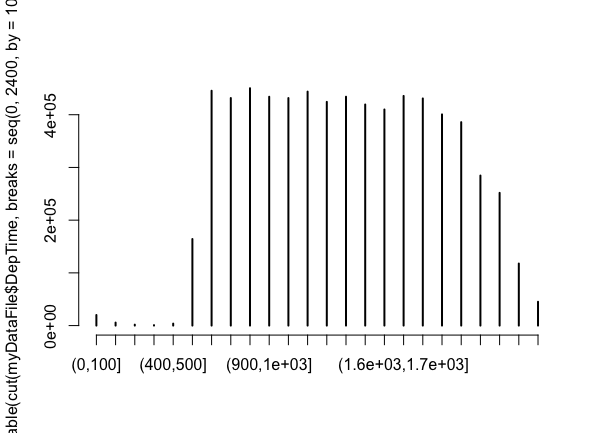

# Introduction to R for Data Science

## Week 2

---

# Table

The `table` command simply creates tabular results of categorical variables.

```r
# The table command will go through all the data and count how many flights
# are of each origin (category) throughout 2008.
> table(myDataFile$Origin)

Output:

ABE    ABI    ABQ    ABY    ACK    ACT    ACV    ACY    ADK    ADQ    AEX    AGS    AKN    ALB
4807   2660  41146   1095    457   1993   3714    116    102    706   2330   2403    116  13474
```

---

# Sort

The `sort` command will sort any tabular data.

```r
# This will sort the data in increasing order
> sort(table(myDataFile$Origin))

Output:

ABE    ABI    ABQ    ABY    ACK    ACT    ACV    ACY    ADK    ADQ    AEX    AGS    AKN    ALB
4807   2660  41146   1095    457   1993   3714    116    102    706   2330   2403    116  13474

# Sort the data in decreasing order
> sort(table(myDataFile$Origin), decreasing=TRUE)
```

---

# Sequence

The `seq` command generates a regular sequence.

```r
# Here the seq command creates a sequence between 0 and 100 with a gap of 10
> seq(0, 100, by=10)

[1]   0  10  20  30  40  50  60  70  80  90  100   --> output
```

---

# Cut

The `cut` command breaks up data into different categories. We can use the mixture of `cut` and `seq` command to cut the airline data in to different categories/ranges.

```r
# Here the cut command will break down the departure time into different
# categories in 24 levels 0 to 100, 100 to 200 and so on for each row of data.
> cut(myDataFile$DepTime, breaks = seq(0, 2400, 100))

Output:

[1] (2e+03,2.1e+03]   (700,800]        
[3] (600,700]         (900,1e+03]      
[5] (1.8e+03,1.9e+03] (1.9e+03,2e+03]  
.
.
```

---

# Plot

The `plot` command in R is a generic function used for plotting.

```r
# Here plot command will plot the sum of departure times between 0-100, 100-200, ... , 2300-2400
> plot(table(cut(myDataFile$DepTime, breaks = seq(0, 2400, by = 100))))
```



---

# Introduction to TAPPLY Function

The tapply function takes these arguments/parameters:

1. The vector of data we want to apply a function to
2. The way to break up the data into pieces
3. The function we want to apply to the data
4. Remove n/a values (optional)

---

# TAPPLY

Example:

```r
# Finds the average departure delay for each airport and sorts it in ascending order
> sort(tapply(myDataFile$DepDelay, myDataFile$Origin, mean, na.rm = TRUE))

Output:

WYS          BLI          INL          PIH          COD          TUP          BTM          BJI
-6.155893536 -5.529411765 -4.802816901 -4.150091519 -3.973549488 -3.800000000 -2.878260870 -2.698630137
IPL          IYK          OXR          SUN          HTS          CDC          PSC          GTF
-2.315897436 -1.911572052 -1.827044025 -1.231340512 -1.141935484 -0.701219512 -0.524322169 -0.499292786
.
.
```

---

# More TAPPLY

```r
# Which day of the week should we fly, if we want to minimize the expected arrival
# delay of flight? Here, 1 represents Monday.
> tapply(myDataFile$ArrDelay, myDataFile$DayOfWeek, mean, na.rm = TRUE)

Output:

1         2         3         4         5         6         7
8.210850  7.481208  6.522017  8.411599 10.953440  5.789666  9.495886

# Use of square brackets to filter out results only for `IND`
> tapply(myDataFile$ArrDelay[myDataFile$Dest == 'IND'], myDataFile$DayOfWeek[myDataFile$Dest == 'IND'], mean, na.rm = TRUE)

Output:

1        2        3        4        5        6        7
6.648562 7.386780 5.623430 6.768748 9.480579 4.706112 9.227550
```

---

# Bonus

What does this piece of code do?

<br>

```r
> atlToLax <- myDataFile$Origin == 'ATL' & myDataFile$Dest == 'LAX'
> tail(sort(tapply(myDataFile$DepDelay[atlToLax], dates[atlToLax], mean, na.rm = TRUE)))
```

<br>

What is the number of flights flown from 'ATL' to 'LAX' that have been delayed by 90 minutes or more?

---

# End of Week 2
