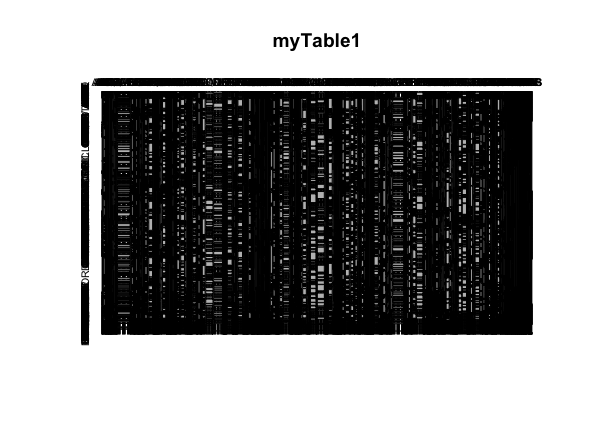
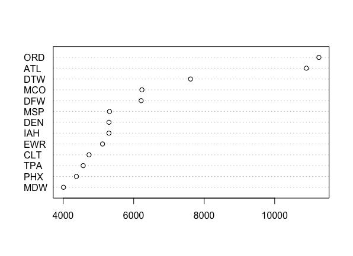

# Introduction to R for Data Science

## Week 4

---

# Combining Multiple Datasets

The `rbind` command can be used to combine multiple datasets.

```r
> df1 <- read.csv('C://Users/Saugat/Downloads/2006.csv')
> df2 <- read.csv('C://Users/saugat/Downloads/2007.csv')
> df3 <- read.csv('C://Users/saugat/Downloads/2008.csv')

# This will combine all these three datasets to one huge dataset consisting
# all the rows.
> myDataFile <- rbind(df1, df2, df3)
```

---

# Question

Make a table that counts the number of entries (simultaneously) according to the origin, destination, and year. How many flights were there from BOS to DEN in 2007?

Use the same data frame we already built. Do not reload all of the 2007 data.

```r
> sum(myDataFile$Origin == 'BOS' & myDataFile$Dest == 'DEN' & myDataFile$Year == 2007)
```

---

# Plot

Plotting should be done incrementally. Plotting large number of data at once won't make sense.

For Example:

```r
> myTable1 <- table(myDataFile$Origin, myDataFile$Dest)

# Neither of these plots will be helpful because the dataset is large
> plot(myTable1)
> dotchart(myTable1)
```

---

# Bad Plot



---

# Making a Better Plot

Let's only take 'IND' and see which destinations have been travelled more
than 4000 times.

```r
# Narrow down flights originating from IND
> v <- myTable1['IND', ]

# Plot a dot chart to see which destinations are travelled most from IND.
# The winner is ORD
> dotchart(sort(v[v > 4000]))
```

---

# Here's The Plot

Most flights from IND to other destinations



---

# Creating Functions

The `function` keyword is used to create functions in R. A function block can contain multiple expression.

```r
# Here activeAirports is a function which returns number of airports for a given state
# A function can also take parameters, here userState is a parameter that the function requires
activeAirports <- function(userState) {
  airports <- subset(airportsDataFile, state == userState)
  a <- table(myDataFile$Origin)[as.character(airports$iata)]
  subset(airportsDataFile, iata %in% names(a[!is.na(v)]))
}

# Calling a function
# This will return all airports in California with some details
> activeAirports('CA')
```

---

# End of Week 4
